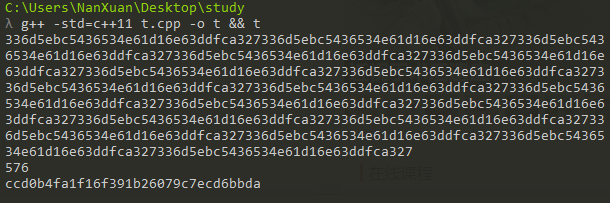
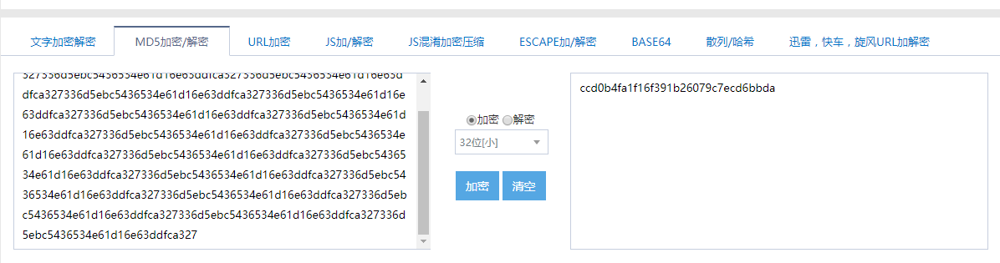
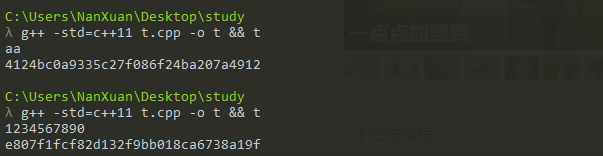
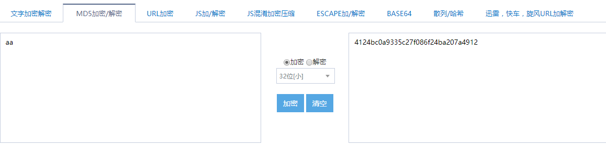
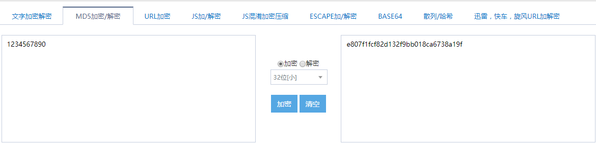

# MD5(Message-Digest Algorithm)

> XXXXXXXXXXXXXXXXXXXXXXXXXXX

1. Design an executable MD5 program in C/C++ with some short samples.
    
    * Usage:
    
        在命令行输入执行命令：

        >  g++ -std=c++11 t.cpp -o t && t

        就可以直接输入待加密的字符串

    * 简单运行测试与网上在线md5加密结果进行对比：

    
    

    
    
    

2. How MD5 works for password protection

    * MD5总体结构

        填充--->分组--->初始化--->总循环--->输出结果

    * MD5结构具体实现

        + 填充：

            输入带加密的字符串后，在原字符串尾部填充一个(uint8_t) 1 (即: 1 << 7 )，再不断填充0直到字符串长度%512等于448。假设原字符串长度为len，取len的低64位，分成ab两个32位二进制数，小端排列为ba,填充进字符串后，最终获得长度为512的倍数的字符串。

        + 分组

            把填充后的字符串每512位为一组，每组分成16个32位长的字
        
        + 初始化

            循环前需要4个寄存器abcd的十六进制初值为初始向量IV，且为小端存储结构
            
            | 值 | 低地址 | --> | --> | 高地址 |
            | ------ | ----- | --- | --- | ----- |
            | A = 0x67452301 | 01 | 23 | 45 | 67 |
            | B = 0xEFCDAB89 | 89 | AB | CD | EF |
            | C = 0x98BADCFE | FE | DC | BA | 98 |
            | D = 0x10325476 | 76 | 54 | 32 | 10 |

        + 总循环

            - 每512位一个大循环，分成16个32位的字，Yq (q = 0, 1, …, 15)，经过4个不同循环的压缩算法：
            CV初始化为IV，以后每次循环得到的新CV用于下一轮循环：

                CV0 = IV

                CVi = HMD5(CVi-1 , Yi)  

            - 四轮循环分别使用生成函数 F, G, H, I，结合指定的 T 表元素 T[] 和消息分组的不同部分做16 次运算，生成下一轮循环的输入

                | 轮次    | Function g | g(b,c,d) |
                | ------- | ----------- | -------- |
                | 1 | F(b,c,d) | (b & c) V ((~b) & d) |
                | 2 | G(b,c,d) | (b & d) V (c & (~d)) |
                | 3 | H(b,c,d) | b ^ c ^ d |
                | 4 | I(b,c,d) | c ^ (b V (~d)) |
                
            - 每轮循环中的一步运算逻辑 a  b + ((a + g(b,c,d) + X[k] + T[i]) <<< s)

            - 总共有64次迭代运算

        + 输出结果
            
            输出循环结束最后得到的CV

