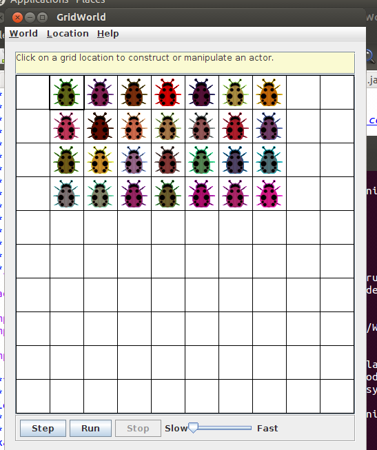
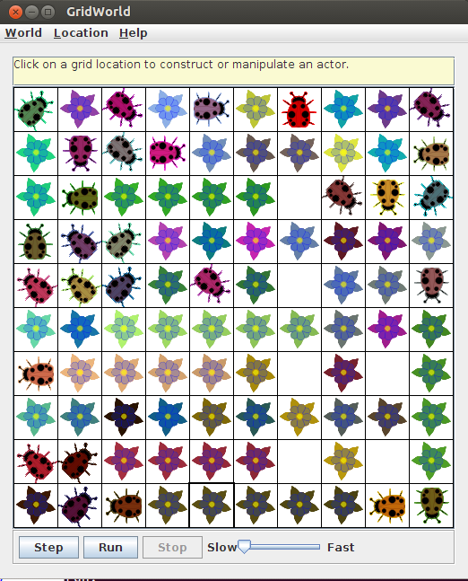

* jumper_code:在配置ant的环境下输入：

>>> ant run

可以运行代码

* jumper_junit_test:

1. 要配置junit4.9才可以测试代码

2. 不能用ant编译运行，我不知道-ea要怎么放进xml里面，哪个同学知道怎么做的麻烦告诉我一声谢谢qaq

3. 

>>> javac -classpath .:junit-4.9.jar:gridworld.jar Jumper.java JumperTest.java

>>> java -classpath .:junit-4.9.jar:gridworld.jar -ea org.junit.runner.JUnitCore JumperTest

* 花了好多时间在可能不必要的事情上……怀疑自己装了一个假的浏览器，郭某人说我装了一个假win10

# ???????????????????????(黑人问号.jpg)

-------------------------------前方高能！！！-----------------------------

其实当时玩得很high的我还没有开始写Part3的代码，虽然晚上要检查了hhhhh

