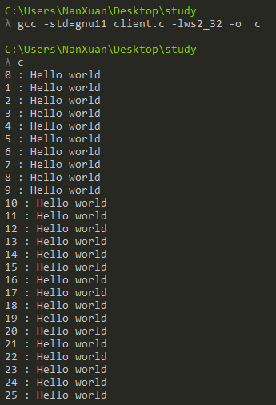
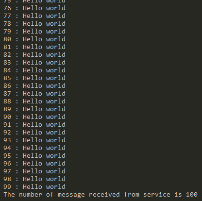
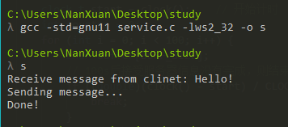

# UDP网络编程

+ 文件组成：服务端(service.c)和客户端(client.c)

+ 运行环境：windows

+ Usage:

    服务器端：打开cmd，输入在cmd输入ipconfig获得本机的ipv4地址后，替换client.c文件第7行的SERVER_ADDR默认地址
    
    运行命令：

    先运行服务端：

    > gcc -std=gnu11 service.c -lws2_32 -o s
    
    > s

    再运行客户端：
    
    > gcc -std=gnu11 client.c -lws2_32 -o c
    
    > c

+ 运行效果：
    
    * 客户端：

        
        

    * 服务端：

        