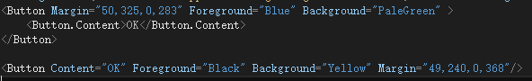
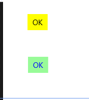
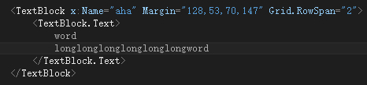
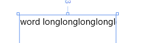
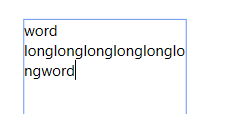

# Xmal零碎的东西
    比较零碎的语法点，边学边记录，有图有真相~

1.属性的语法

Xmal有这两种方式声明工具的属性，假如某属性例如Content/Text特别长的话，无疑第一种是最佳选择，效果如下图；

2.关于TextBlock的文本换行

结论：这里的换行是被当作空格的；默认情况下不换行(Nowrap)

让我在TextBlock加个属性TextWrapping="Wrap"，其他不变，效果如下：

结论：每行的字符串长度超过文本框时就换行，不管字符串是不是同一个单词

试下TextWrapping="WrapWholeWords"

结论：如果是一个单词，就算长度超过文本框也不换行

### -----额各位，出了点事故，写到这里才发现Markdown支持高亮代码-----

